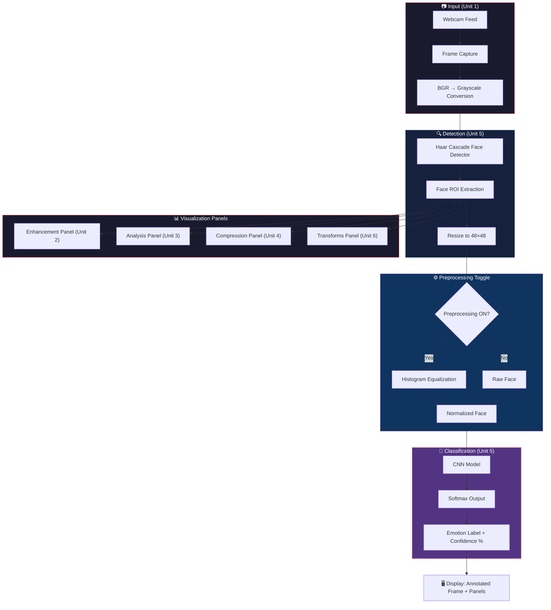
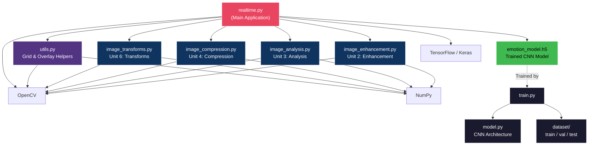
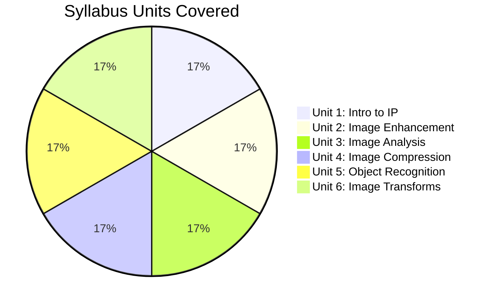
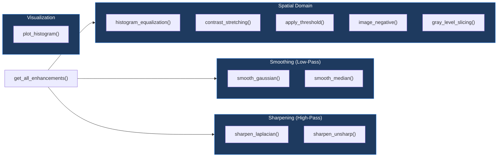
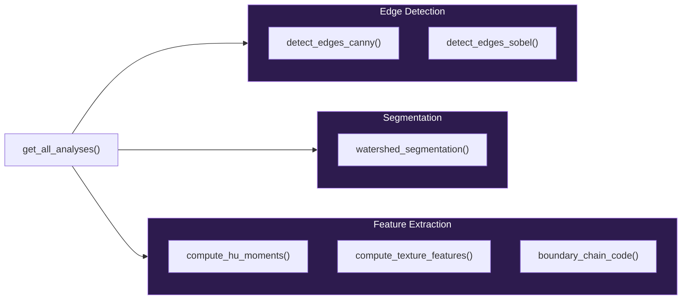
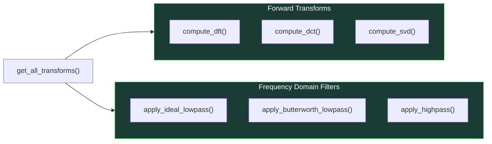
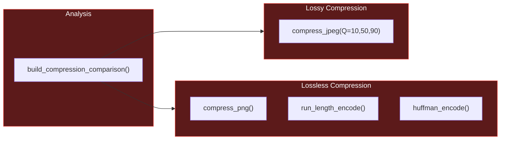
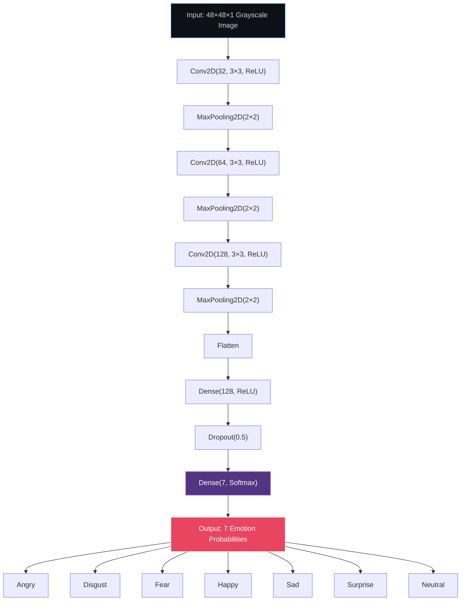

# 🎭 Real-Time Emotion Detection

> **Image Processing Course Project** — Demonstrates all 6 units of the IP syllabus through a real-time webcam-based facial emotion recognition system.

A deep learning-powered application that detects human faces via webcam and classifies their emotions in real-time, while providing interactive visualizations of core image processing concepts including enhancement, segmentation, transforms, and compression.

---

## 📑 Table of Contents

- [Features](#-features)
- [System Architecture](#-system-architecture)
- [How It Works](#-how-it-works)
- [IP Syllabus Coverage](#-ip-syllabus-coverage)
- [Project Structure](#-project-structure)
- [Installation](#-installation)
- [Usage](#-usage)
- [Module Details](#-module-details)
- [Model Architecture](#-model-architecture)
- [Tech Stack](#-tech-stack)

---

## ✨ Features

- **Real-time face detection** using Haar Cascade classifier
- **Emotion classification** into 7 categories using a CNN (Convolutional Neural Network)
- **Interactive visualization panels** for Image Processing concepts, toggled via keyboard
- **Live histogram** display of detected face
- **Preprocessing toggle** to see the effect of histogram equalization on prediction accuracy
- **Compression analysis** with real-time JPEG, RLE, and Huffman coding statistics

---

## 🏗 System Architecture

### High-Level System Flow



### Detailed Processing Pipeline

```mermaid
graph LR
    subgraph Stage1["Stage 1: Acquisition"]
        A1["cv2.VideoCapture(0)"] --> A2["Read Frame"]
        A2 --> A3["cv2.cvtColor BGR→GRAY"]
    end

    subgraph Stage2["Stage 2: Detection"]
        A3 --> B1["detectMultiScale()"]
        B1 --> B2["Extract face ROI"]
        B2 --> B3["cv2.resize(48×48)"]
    end

    subgraph Stage3["Stage 3: Processing"]
        B3 --> C1["Pixel Normalization /255"]
        C1 --> C2["Reshape (1,48,48,1)"]
    end

    subgraph Stage4["Stage 4: Prediction"]
        C2 --> D1["Conv2D(32) + MaxPool"]
        D1 --> D2["Conv2D(64) + MaxPool"]
        D2 --> D3["Conv2D(128) + MaxPool"]
        D3 --> D4["Flatten + Dense(128)"]
        D4 --> D5["Dropout(0.5)"]
        D5 --> D6["Dense(7) Softmax"]
    end

    subgraph Stage5["Stage 5: Output"]
        D6 --> E1["argmax → Emotion"]
        D6 --> E2["max → Confidence"]
        E1 --> E3["Display on Frame"]
        E2 --> E3
    end

    style Stage1 fill:#0d1117,stroke:#58a6ff,color:#c9d1d9
    style Stage2 fill:#0d1117,stroke:#3fb950,color:#c9d1d9
    style Stage3 fill:#0d1117,stroke:#d29922,color:#c9d1d9
    style Stage4 fill:#0d1117,stroke:#bc8cff,color:#c9d1d9
    style Stage5 fill:#0d1117,stroke:#f85149,color:#c9d1d9
```



### Module Dependency Architecture



---

## 🔄 How It Works

### 1. Image Acquisition (Unit 1)

The system captures frames from the webcam using OpenCV's `VideoCapture`. Each frame is a BGR color image which is immediately converted to **grayscale** — a fundamental color space transformation. The face region is **resampled** (resized) to 48×48 pixels and **normalized** (pixel values divided by 255) before being fed to the neural network.

### 2. Face Detection (Unit 5 — Object Recognition)

OpenCV's **Haar Cascade Classifier** is used for face detection. This is a classical object recognition approach that uses:
- **Haar-like features** (rectangular features that capture intensity differences)
- **Integral images** for fast feature computation
- **AdaBoost** cascade of classifiers for efficient detection

The detector scans the frame at multiple scales and returns bounding boxes around detected faces.

### 3. Emotion Classification (Unit 5 — Pattern Classification)

The detected face is fed into a **Convolutional Neural Network (CNN)** that classifies it into one of 7 emotion categories:

| Class | Emotion |
|-------|---------|
| 0 | Angry |
| 1 | Disgust |
| 2 | Fear |
| 3 | Happy |
| 4 | Sad |
| 5 | Surprise |
| 6 | Neutral |

The CNN outputs a probability distribution via **softmax**, and the class with the highest probability is selected as the predicted emotion.

### 4. Image Enhancement (Unit 2)

When the Enhancement panel is activated (press `1`), the following techniques are applied to the detected face and displayed side-by-side:

| Technique | Method | Purpose |
|-----------|--------|---------|
| Histogram Equalization | `cv2.equalizeHist()` | Improves contrast by redistributing pixel intensities |
| Contrast Stretching | Min-Max normalization | Stretches pixel range to full 0–255 |
| Image Negative | `255 - pixel` | Inverts intensities for dark region analysis |
| Gaussian Blur | `cv2.GaussianBlur()` | Low-pass spatial filter for noise reduction |
| Median Filter | `cv2.medianBlur()` | Removes salt-and-pepper noise while preserving edges |
| Laplacian Sharpening | `cv2.Laplacian()` | High-pass filter to enhance edges |
| Unsharp Masking | Original + amplified detail | Derivative-based sharpening technique |

### 5. Image Analysis (Unit 3)

When the Analysis panel is activated (press `2`):

- **Canny Edge Detection** — Multi-stage edge detector (Gaussian smoothing → gradient → non-max suppression → hysteresis thresholding)
- **Sobel Edge Detection** — Gradient-based operator computing X and Y derivatives
- **Watershed Segmentation** — Treats image as topographic surface, floods from markers to find region boundaries
- **Hu Moments** — 7 rotation/scale/translation-invariant shape descriptors
- **Texture Features** — Contrast, energy, homogeneity, and smoothness of pixel neighborhoods
- **Freeman Chain Code** — 8-directional boundary representation of the largest contour

### 6. Image Compression (Unit 4)

When the Compression panel is activated (press `3`):

- **JPEG Compression** — Lossy compression at Q=10, Q=50, Q=90 with visual comparison and file size
- **PNG Compression** — Lossless compression baseline
- **Run-Length Encoding (RLE)** — Encodes consecutive identical pixel runs as (value, count) pairs
- **Huffman Coding** — Variable-length prefix coding assigning shorter codes to frequent pixel values

### 7. Image Transforms (Unit 6)

When the Transforms panel is activated (press `4`):

- **2D DFT (Discrete Fourier Transform)** — Converts face to frequency domain; magnitude spectrum shows frequency content
- **DCT (Discrete Cosine Transform)** — Real-valued transform used in JPEG; energy concentrates in top-left
- **SVD (Singular Value Decomposition)** — Matrix decomposition; reconstructs face using only top-k singular values
- **Ideal Low-Pass Filter** — Passes frequencies within a circular cutoff, blocks the rest
- **Butterworth Low-Pass Filter** — Smooth frequency cutoff (no ringing artifacts)
- **Ideal High-Pass Filter** — Blocks low frequencies, reveals edge structure

---

## 📚 IP Syllabus Coverage



| Unit | Topic | Concepts Demonstrated | File |
|------|-------|----------------------|------|
| **1** | Introduction to IP | Grayscale conversion (BGR→Gray), image resampling (resize to 48×48), pixel normalization, image formats (PNG, JPEG) | `realtime.py` |
| **2** | Image Enhancement | Histogram equalization, contrast stretching, thresholding, image negative, Gaussian smoothing (LPF), median filtering, Laplacian sharpening (HPF), unsharp masking, histogram visualization | `image_enhancement.py` |
| **3** | Image Analysis | Canny edge detection, Sobel edge detection, watershed segmentation, Hu moments (moment-based descriptor), texture features, Freeman chain code (boundary representation) | `image_analysis.py` |
| **4** | Image Compression | JPEG lossy compression (DCT-based), PNG lossless, Run-Length Encoding (RLE), Huffman coding, compression ratio analysis, coding redundancy | `image_compression.py` |
| **5** | Object Recognition | Haar Cascade face detection (automated object recognition), CNN pattern classification, 7-class emotion recognition | `realtime.py`, `model.py` |
| **6** | Image Transforms | 2D DFT + magnitude spectrum, DCT, SVD decomposition + reconstruction, ideal low-pass filter, Butterworth low-pass filter, ideal high-pass filter | `image_transforms.py` |

---

## 📁 Project Structure

```
Real-Time-Emotion-Detection/
│
├── realtime.py               # Main application — real-time webcam demo with all panels
├── model.py                  # CNN architecture definition (3 conv blocks + dense layers)
├── train.py                  # Training script with data augmentation & early stopping
├── test.py                   # Single image prediction test
├── emotion_model.h5          # Pre-trained CNN model (~4.3 MB)
│
├── image_enhancement.py      # Unit 2: Image Enhancement techniques
├── image_analysis.py         # Unit 3: Image Analysis & Segmentation
├── image_compression.py      # Unit 4: Image Compression algorithms
├── image_transforms.py       # Unit 6: Image Transforms & Frequency Filters
├── utils.py                  # Helper utilities for grid display & overlays
│
├── convert_dataset.py        # One-time utility to rename dataset folders
├── verify_modules.py         # Test script to verify all IP modules
├── test.png                  # Sample test image
│
└── dataset/                  # FER-2013 dataset
    ├── train/                # Training images
    │   ├── angry/
    │   ├── disgust/
    │   ├── fear/
    │   ├── happy/
    │   ├── neutral/
    │   ├── sad/
    │   └── surprise/
    ├── val/                  # Validation images
    └── test/                 # Test images
```

---

## ⚙️ Installation

### Prerequisites

- Python 3.10+ 
- Webcam (for real-time detection)

### Setup

```bash
# Clone the repository
git clone https://github.com/rushipatilsawale/Real-Time-Emotion-Detection.git
cd Real-Time-Emotion-Detection

# Install dependencies
pip install tensorflow opencv-python numpy
```

### Verify Installation

```bash
python verify_modules.py
```

Expected output:
```
Test image shape: (48, 48)
[Unit 2] Enhancement: 8 techniques ✅
[Unit 3] Analysis: 4 techniques ✅
[Unit 6] Transforms: 6 techniques ✅
[Unit 4] Compression: 3 comparisons ✅
All IP modules working correctly!
```

---

## 🚀 Usage

### Real-Time Demo (Main Application)

```bash
python realtime.py
```

#### Keyboard Controls

| Key | Action | Syllabus Unit |
|-----|--------|---------------|
| `1` | Toggle Enhancement panel (8 spatial/frequency techniques) | Unit 2 |
| `2` | Toggle Analysis panel (edges, segmentation, features) | Unit 3 |
| `3` | Toggle Compression panel (JPEG, RLE, Huffman comparison) | Unit 4 |
| `4` | Toggle Transforms panel (DFT, DCT, SVD, frequency filters) | Unit 6 |
| `H` | Toggle live histogram of detected face | Unit 2 |
| `P` | Toggle histogram equalization preprocessing before CNN | Unit 2 |
| `ESC` | Quit the application | — |

### Single Image Test

```bash
python test.py
```

### Train the Model (if needed)

```bash
python train.py
```

This trains the CNN on the dataset with data augmentation for up to 30 epochs with early stopping.

---

## 📦 Module Details

### `image_enhancement.py` — Unit 2



### `image_analysis.py` — Unit 3



### `image_transforms.py` — Unit 6



### `image_compression.py` — Unit 4



---

## 🧠 Model Architecture



### Training Configuration

| Parameter | Value |
|-----------|-------|
| Input Size | 48×48×1 (grayscale) |
| Optimizer | Adam (lr=0.001) |
| Loss Function | Categorical Cross-Entropy |
| Epochs | 30 (with early stopping) |
| Batch Size | 64 |
| Early Stopping | patience=5, monitors val_loss |
| Data Augmentation | rotation (±20°), zoom (0.2), horizontal flip, shift (0.1) |

---

## 🛠 Tech Stack

| Technology | Purpose |
|-----------|---------|
| **Python 3.10+** | Programming Language |
| **TensorFlow / Keras** | Deep Learning Framework (CNN model) |
| **OpenCV** | Computer Vision (face detection, image processing, webcam) |
| **NumPy** | Numerical Computing (array operations, FFT) |

---

## 📄 License

This project is developed as an academic course project for the **Image Processing** course.

---

<p align="center">
  Made with ❤️ for IP Course Project
</p>
